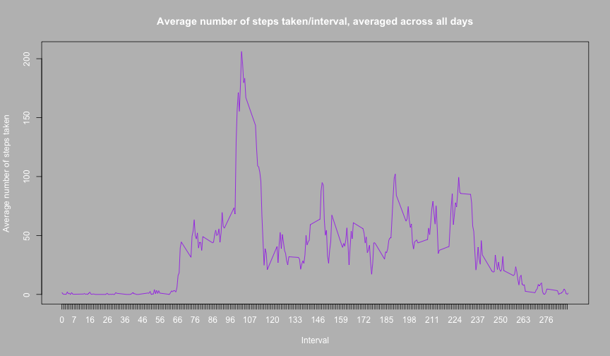

PEER ASSESSMENT 1
==========

*Note : The .csv data file has to be in the location as the markdownfile.*

**Loading and preprocessing the data:**

```r
mydata <- read.csv("activity.csv", header = TRUE)
mydata <- mydata[!is.na(mydata$steps), ]
```

--------------------------------------
--------------------------------------
--------------------------------------

**What is mean total number of steps taken per day?**

The blank spaces in the histogram indicate missing values.

```r
totalsteps <- tapply(mydata$steps, mydata$date, sum, na.rm = TRUE)
par(bg = "grey", col.main = "white", col.sub = "white", col.axis = "white", 
    col.lab = "white")
plot(x = c(1:61), y = totalsteps, type = "h", col = "blue", xlab = "Days[2012-10-01 to 2012-11-30]", 
    ylab = "Total Steps", main = "Total number of steps taken each day", xaxt = "n")
axis(side = 1, at = c(1:length(levels(mydata$date))))
```

 

```r
## Mean of totalsteps per day.
mean(totalsteps, na.rm = TRUE)
```

```
## [1] 10766
```

```r
## Median of totalsteps per day
median(totalsteps, na.rm = TRUE)
```

```
## [1] 10765
```

--------------------------------------
--------------------------------------
--------------------------------------

**What is the average daily activity pattern?**

```r
averagesteps <- tapply(mydata$steps, as.factor(mydata$interval), mean, na.rm = TRUE)
par(bg = "grey", col.main = "white", col.sub = "white", col.axis = "white", 
    col.lab = "white")
plot(x = names(averagesteps), y = averagesteps, type = "l", col = "purple", 
    main = "Average number of steps taken/interval, averaged across all days", 
    xlab = "Interval", ylab = "Average number of steps taken", xaxt = "n")
axis(side = 1, at = names(averagesteps))
```

 


The interval with maximum number of steps is:

```r
names(averagesteps[which(averagesteps == max(averagesteps))])
```

```
## [1] "835"
```

--------------------------------------
--------------------------------------
--------------------------------------

**Imputing missing values**

```r
mydata <- read.csv("activity.csv", header = TRUE)
## The total number of rows with missing values are displayed below:
nrow(mydata[which(!complete.cases(mydata)), ])
```

```
## [1] 2304
```

```r

### Function which takes in arguments a dataset,column to be imputed and a
### factor column. The values in the column_impute are averaged for each
### factor and the missing values are replaced by one of these average values
### depending on which factor they correspond to.
imputeByFactor <- function(data, column_impute, column_factor) {
    averagetable <- tapply(data[, column_impute], as.factor(data[, column_factor]), 
        mean, na.rm = TRUE)
    
    for (i in 1:nrow(data)) {
        if (is.na(data[i, column_impute])) {
            data[i, column_impute] = averagetable[which(row.names(averagetable) == 
                data[i, column_factor])]
        }
    }
    return(data)
}

### In the below function call we impute the first column of the dataset named
### 'mydata' according to the factor levels in the third column.
imputed_dataset <- imputeByFactor(mydata, 1, 3)
head(imputed_dataset)
```

```
##     steps       date interval
## 1 1.71698 2012-10-01        0
## 2 0.33962 2012-10-01        5
## 3 0.13208 2012-10-01       10
## 4 0.15094 2012-10-01       15
## 5 0.07547 2012-10-01       20
## 6 2.09434 2012-10-01       25
```

```r
### Sample of the imputed dataset is shown above.
```


```r
imputed_totalsteps <- tapply(imputed_dataset$steps, imputed_dataset$date, sum, 
    na.rm = TRUE)
par(bg = "grey", col.main = "white", col.sub = "white", col.axis = "white", 
    col.lab = "white")
plot(x = c(1:length(imputed_totalsteps)), y = imputed_totalsteps, type = "h", 
    col = "blue", xlab = "Days[2012-10-01 to 2012-11-30]", ylab = "Total Steps", 
    main = "Total number of steps taken each day [Imputed Dataset]", xaxt = "n")
axis(side = 1, at = c(1:length(levels(imputed_dataset$date))))
```

 

```r
mean(imputed_totalsteps)
```

```
## [1] 10766
```

```r
median(imputed_totalsteps)
```

```
## [1] 10766
```

```r
## The mean and median of the total number of steps daily is displayed above.
```


From the above values it can be seen that the mean is the same as above and the median is changed by one. Thus, there is no major difference between the values of estimates in the first case and the present case. Thus, we can also concur that the method used for imputation is acceptable as it doesnt lead to a noticeable change in any analysis. Having said that it is definitely possible to alter the estimates greatly if wrong imputation methods or algorithms are selected.


```r
imputed_dataset$date = as.Date(as.character(imputed_dataset$date), format = "%Y-%m-%d")
imputed_dataset$date = weekdays(imputed_dataset$date)
imputed_dataset$date = as.character(imputed_dataset$date)

for (i in 1:length(imputed_dataset$date)) {
    switch(imputed_dataset$date[i], Monday = (imputed_dataset$new_date[i] = "weekday"), 
        Tuesday = (imputed_dataset$new_date[i] = "weekday"), Wednesday = (imputed_dataset$new_date[i] = "weekday"), 
        Thursday = (imputed_dataset$new_date[i] = "weekday"), Friday = (imputed_dataset$new_date[i] = "weekday"), 
        Saturday = (imputed_dataset$new_date[i] = "weekend"), Sunday = (imputed_dataset$new_date[i] = "weekend"), 
        stop("invalid outcome"))
}
imputed_dataset$new_date <- as.factor(imputed_dataset$new_date)
imputed_averagesteps <- tapply(imputed_dataset$steps, as.factor(imputed_dataset$interval), 
    mean)
```


```r
library(plyr)
library(lattice)
imputed_average_steps <- ddply(imputed_dataset, .(new_date, interval), summarize, 
    average_steps = mean(steps))
xyplot(average_steps ~ interval | new_date, data = imputed_average_steps, mfcol = 2, 
    type = "l", layout = c(1, 2), main = "Average number of Steps vs Intervals", 
    xlab = "Intervals", ylab = "Average number of steps")
```

 
